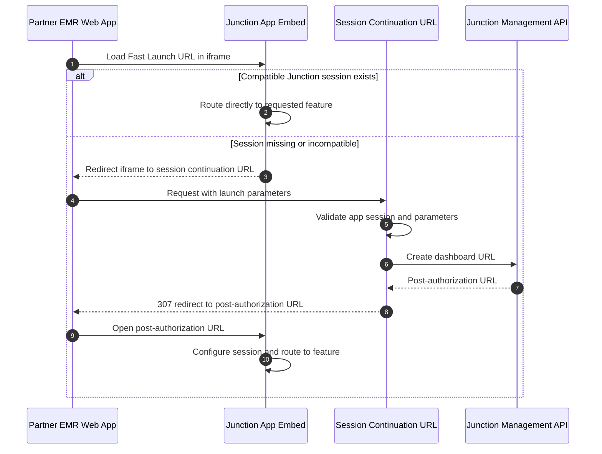

import ContactCsm from '/snippets/contact-csm.mdx';

<ContactCsm />

Fast Launch lets your client-side application open a Junction feature without first asking your backend to create a dashboard URL. When Junction detects an existing compatible session, it routes directly to the requested feature. If it cannot reuse a session, it redirects to your [session continuation URL](/app-embed/session-continuation), where your application creates a new dashboard URL.

Use Fast Launch when:

* you embed Junction features in iframes; and
* users often move between parts of your app that embed different Junction features.

## Fast Launch URL

Use your partner integration slug as the subdomain.

```text
https://{integration_slug}.ehr.junction.com/auth/launch
```

You can identify the target member and team with either partner references or Junction IDs.

<CodeGroup>

```text Partner references
https://{integration_slug}.ehr.junction.com/auth/launch
  ?integration_member_id={integration_member_id}
  &integration_team_id={integration_team_id}
  &modality={modality}
  &feature={feature}
  &environment={environment}
```

```text Junction IDs
https://{integration_slug}.ehr.junction.com/auth/launch
  ?member_id={member_id}
  &team_id={team_id}
  &modality={modality}
  &feature={feature}
  &environment={environment}
```

</CodeGroup>

| Parameter | Description |
| --- | --- |
| `integration_member_id` | Your unique reference for the member. Mutually exclusive with `member_id`. |
| `member_id` | Junction-issued member ID. Mutually exclusive with `integration_member_id`. |
| `integration_team_id` | Your unique reference for the team. Mutually exclusive with `team_id`. |
| `team_id` | Junction-issued team ID. Mutually exclusive with `integration_team_id`. |
| `modality` | `feature_embed` or `link_out`. |
| `feature` | Supported feature slug, such as `order_creation` or `team_config`. |
| `environment` | `sandbox` or `production`. |

## Feature Embed flow



## Link Out flow

For Link Out, open the same Fast Launch URL in a top-level browser context. If Junction can reuse the session, it routes immediately. Otherwise, it redirects the browser to your session continuation URL before returning to Junction with a new post-authorization URL.

## Implementation notes

* Keep the `feature`, `modality`, and `environment` values in your own allowlist.
* Prefer partner references (`integration_member_id` and `integration_team_id`) when they are already available in your client runtime.
* Your session continuation endpoint must validate the current partner session before creating the dashboard URL.
