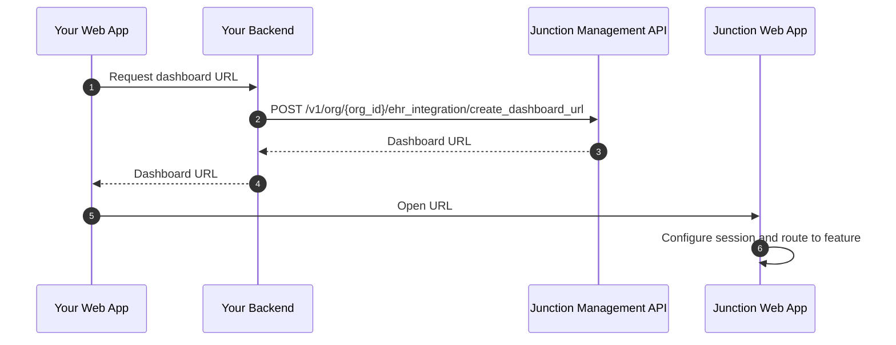

import ContactCsm from '/snippets/contact-csm.mdx';

<ContactCsm />

App Embed enables you to integrate the Junction Dashboard provider experience seamlessly into your existing web application.
This serves as an alternative to building your own provider experience on top of the [Lab Testing API](/lab/overview/introduction).

## Modalities

Junction supports two App Embed modalities:

| Modality | Experience | Use when |
| --- | --- | --- |
| Link Out | Opens Junction Dashboard in a top-level browser context, such as a new tab or popup window. | You want the provider to leave your app context and use the full Junction Dashboard. |
| Feature Embed | Embed a specific Junction Dashboard provider experience as an iframe into your web application. | You want your web application to own navigation and information architecture, while Junction provides a focused provider experience. |

## Features

App Embed supports the following features:

| Feature slug | Feature |
| --- | --- |
| `order_creation` | Order creation |
| `order_creation:{user_id}` | Order creation for a specific patient (user) |
| `order:{id}` | Order detail |
| `team_panels` | Panel management |
| `team_config` | Team configuration |

While you must specify a feature to launch for both the _Link Out_ and _Feature Embed_ modalities, they have different behaviours:

| Modality | Behaviour |
| --- | --- |
| Link Out      | The feature controls where the Junction Dashboard lands on initially. The provider can navigate away afterwards, and use other parts of the Junction Dashboard. |
| Feature Embed | The iframe is locked to the feature you requested. |

## Core flow

<Steps>
  <Step title="Prepare identity and team records">
    Use the Junction Management API to create or resolve the team and integration-managed member for the current provider.
  </Step>
  <Step title="Create a Dashboard URL">
    Call [Create Dashboard URL](/api-reference/org-management/ehr-integration/create-dashboard-url) with the target member, team, modality, feature, and environment.
  </Step>
  <Step title="Launch the App Embed">
    Open the returned Dashboard URL in a top-level browser context for Link Out, or load it in an iframe for Feature Embed.
  </Step>
</Steps>

