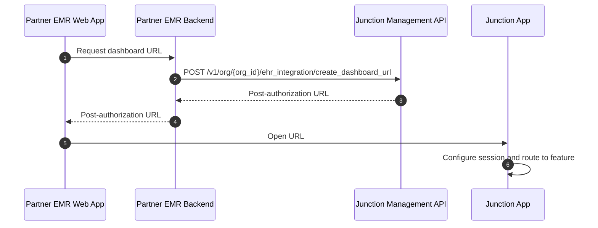

App Embed lets partner EMRs launch Junction Dashboard experiences for a specific integration-managed member and team. Use it when your users already sign in to your application, and you want them to open Junction workflows without creating separate Junction Dashboard credentials.

<Info>
App Embed requires partner registration through Junction. Your integration must be configured with a partner integration slug, allowed origins, enabled modalities, and a session continuation URL before launch.
</Info>

## Integration modalities

Junction supports two App Embed modalities:

| Modality | Experience | Use when |
| --- | --- | --- |
| Link Out | Opens Junction Dashboard in a top-level browser context, such as a new tab or popup window. | You want users to leave your app context and use the full Junction Dashboard. |
| Feature Embed | Opens a specific Junction Dashboard feature in an iframe embedded in your web application. | You want to own navigation and information architecture while Junction provides a focused workflow. |

In Feature Embed, Junction does not show the full Dashboard navigation. Your application remains responsible for routing users between embedded features.

## Integration settings

| Setting | Description |
| --- | --- |
| Partner integration slug | A unique kebab-case slug that identifies your application, such as `my-clinical-practice`. Fast Launch uses this slug in the launch URL host. |
| Modalities | The App Embed modalities your integration can use: `link_out`, `feature_embed`, both, or none. |
| Session continuation URL | A publicly accessible endpoint in your application that can recover or create a Junction session for the current user. |
| Allowed origins | Origins allowed to launch Link Out or Feature Embed sessions. Junction checks the request referer, and the host of your session continuation URL is automatically included. |

## Integration-managed members

App Embed launches Junction as an integration-managed member. These members are created and managed through the Junction Management API by your integration.

Integration-managed members:

* can sign in only through App Embed launch flows;
* cannot sign in through Junction Dashboard identity providers; and
* can be assigned team role bindings when created or updated.

## Supported features

Use the `feature` parameter when creating a dashboard URL or Fast Launch URL.

| Feature slug | Feature |
| --- | --- |
| `order_creation` | Order creation |
| `order_creation:{user_id}` | Order creation for a specific user |
| `order:{id}` | Order detail for `{order_id}` |
| `team_panels` | Panel management |
| `team_config` | Team configuration |

## Core flow

<Steps>
  <Step title="Prepare identity and team records">
    Use the Junction Management API to create or resolve the team and integration-managed member for the current user.
  </Step>
  <Step title="Create a dashboard URL">
    Call [Create Dashboard URL](/api-reference/org-management/ehr-integration/create-dashboard-url) with the target member, team, modality, feature, and environment.
  </Step>
  <Step title="Launch Junction">
    Open the returned post-authorization URL in a top-level browser context for Link Out, or load it in an iframe for Feature Embed.
  </Step>
</Steps>

