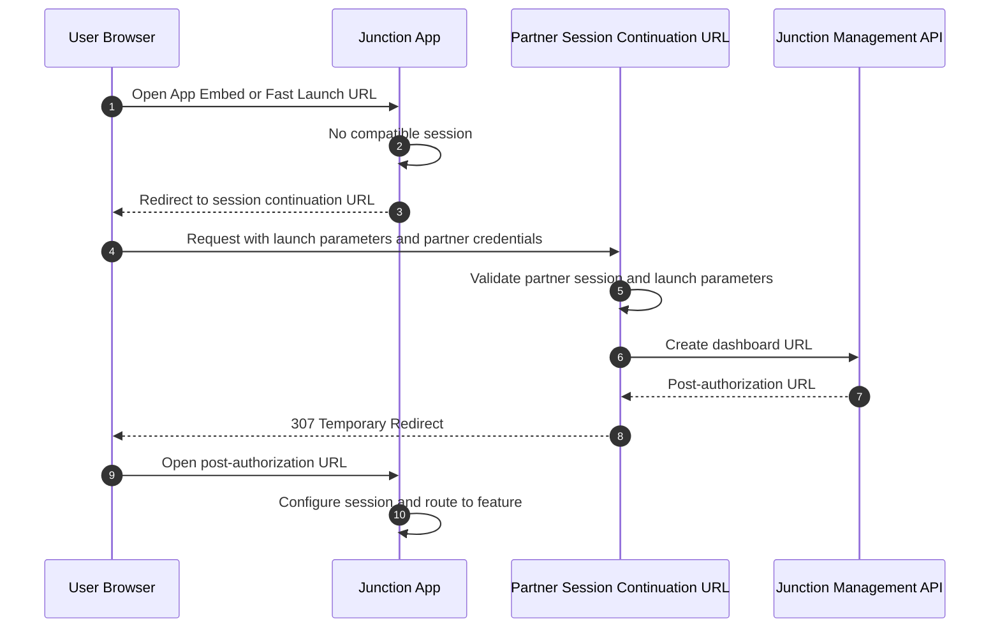

Session continuation lets Junction recover an App Embed session when no compatible session exists, such as after prolonged inactivity or when using Fast Launch.

Your session continuation URL must be a publicly accessible endpoint controlled by your application. Junction redirects the user's browser to this endpoint with launch parameters. Your application validates the current signed-in user, creates a Junction dashboard URL, and returns a `307 Temporary Redirect` to that URL.

## Requirements

Your endpoint must:

* validate that the browser has a valid session with your application;
* verify that the requested integration member and team match the signed-in user and account context;
* validate the requested modality, feature, and environment before forwarding them to Junction;
* create a dashboard URL through the Junction Management API; and
* respond with a `307 Temporary Redirect` to the returned post-authorization URL.

<Warning>
Do not blindly forward query parameters into the Management API. Treat session continuation requests as untrusted input and authorize them against your application's current session.
</Warning>

## Continuation flow



## Example endpoint

```python
from typing import Annotated

import httpx
from fastapi import APIRouter, HTTPException, Query, Request
from pydantic import BaseModel, HttpUrl
from starlette.responses import RedirectResponse

router = APIRouter()


class CreateDashboardURLResponse(BaseModel):
    url: HttpUrl
    expires_in: int


@router.get("/junction-session-continuation")
async def handle_junction_session_continuation(
    request: Request,
    integration_member_id: Annotated[str, Query()],
    integration_team_id: Annotated[str | None, Query()] = None,
    team_id: Annotated[str | None, Query()] = None,
    modality: Annotated[str, Query()] = "feature_embed",
    feature: Annotated[str, Query()] = "order_creation",
    environment: Annotated[str, Query()] = "sandbox",
) -> RedirectResponse:
    session_user = await verify_valid_session_cookie(request)

    if session_user.integration_member_id != integration_member_id:
        raise HTTPException(401, "Invalid continuation request")

    if modality not in {"feature_embed", "link_out"}:
        raise HTTPException(400, "Invalid modality")

    if feature not in allowed_features_for_user(session_user):
        raise HTTPException(403, "Feature is not allowed")

    payload = {
        "integration_member_id": integration_member_id,
        "modality": modality,
        "feature": feature,
        "environment": environment,
    }

    if integration_team_id is not None:
        payload["integration_team_id"] = integration_team_id
    elif team_id is not None:
        payload["team_id"] = team_id

    async with httpx.AsyncClient() as client:
        response = await client.post(
            f"https://api.management.junction.com/v1/org/{org_id}/ehr_integration/create_dashboard_url",
            headers={"X-Management-Key": management_key},
            json=payload,
        )
        response.raise_for_status()
        dashboard_url = CreateDashboardURLResponse.model_validate_json(response.text)

    return RedirectResponse(str(dashboard_url.url), status_code=307)
```

## Redirect status

Use `307 Temporary Redirect` so the browser follows the continuation result without treating it as a permanent redirect. This keeps future session recovery requests pointed at your session continuation URL.
