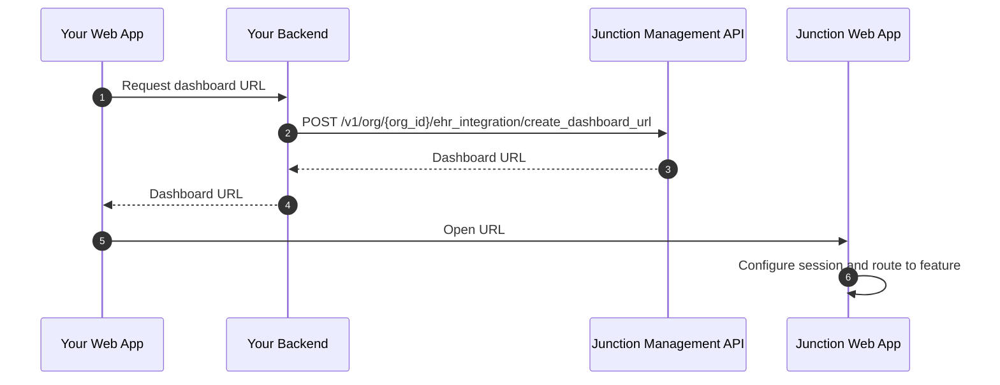

import ContactCsm from '/snippets/contact-csm.mdx';

<ContactCsm />

## Preface

Junction Connect helps you integrate Junction Dashboard features into your web application.

To facilitate this, Junction Connect makes a few assumptions:

1. You programmatically manage the profiles of the providers as [integration-managed members](#integration-managed-members).
2. An integration-managed member must be at least a **team admin** of the team for Junction Connect to work.

What _provider_ means in your use case may differ. Here are two example mappings for your consideration:

<AccordionGroup>
<Accordion title="I am a health care practice..." icon="hospital" defaultOpen>

| Junction noun   | Synonym | Meaning | API |
| ------ | ---------------- | ------- | --- |
| Org    | -                | Your business entity. | [Management API](/api-details/junction-management-api) |
| Team   | -                | A division in your Junction organization, containing an isolated pool of *users*. | [Management API](/api-details/junction-management-api) |
| Member Org Admin | Staff  | Your members of staff. | [Management API](/api-details/junction-management-api) |
| Member Team Admin | Provider 📍  | Your members of staff, with access restricted to a specific set of *teams*. | [Management API](/api-details/junction-management-api) |
| User   | Patient          | An end user of the device and lab testing services; belongs to a *team*. | [Junction API](/api-details/junction-api) |
</Accordion>
<Accordion title="I am an EMR..." icon="database" defaultOpen>

| Junction noun   | Synonym | Meaning | API |
| ------ | ---------------- | ------- | --- |
| Org    | -                | Your business entity. | [Management API](/api-details/junction-management-api) |
| Team   | -                | A customer of yours. | [Management API](/api-details/junction-management-api) |
| Member Org Admin | -         | Your own members of staff. | [Management API](/api-details/junction-management-api) |
| Member Team Admin | Provider 📍 | A customer's members of staff. | [Management API](/api-details/junction-management-api) |
| User   | Patient          | An end user of the device and lab testing services; belongs to a *team*. | [Junction API](/api-details/junction-api) |
</Accordion>
</AccordionGroup>

## Core flow

<Steps>
  <Step title="Prepare identity and team records">
    Use the Junction Management API to create or resolve the team and integration-managed member for the current provider.
  </Step>
  <Step title="Create a Dashboard URL">
    Call [Create Dashboard URL](/api-reference/org-management/connect/create-dashboard-url) with the target member, team, modality, feature, and environment.
  </Step>
  <Step title="Launch Junction Connect">
    Open the returned Dashboard URL in a top-level browser context for Link Out, or load it in an iframe for Feature Embed.
  </Step>
</Steps>

## Configuration

You can configure Junction Connect either through ["Org Config → Junction Connect"](https://app.junction.com/org/ehr-integration) in the Junction Dashboard, or programmatically via the [Set Junction Connect Configuration](/api-reference/org-management/connect/set-configuration) endpoint on the Junction Management API.

| Setting | Description |
| --- | --- |
| Unique slug | A unique kebab-case slug that identifies your organization, e.g., `my-clinical-practice`. Your [Fast Launch](/connect/fast-launch) subdomain is based on this slug. |
| Modalities | The Junction Connect modalities you intend to use: `link_out`, `feature_embed`, both, or none. |
| Allowed origins | Origins allowed to launch Link Out or Feature Embed sessions.  For each origin, you may optionally specify a publicly accessible [Session Continuation URL](/connect/session-continuation). If this is left unspecified, [Fast Launch](/connect/fast-launch) will not work, and Junction Connect will show an error screen when it encounters a launch error or an irrecoverable client session. |

## Integration-managed members

To launch Junction Connect in either modality, identify the provider who should use Junction Dashboard as an integration-managed member.

These members are created and managed through the Junction Management API by your backend system.

Integration-managed members:

* can sign in only through Junction Connect launch flows;
* cannot sign in through Junction Dashboard identity providers; and
* can be assigned team role bindings when created or updated.

## Feature slug

[Features](/connect/overview#features) are represented by a **feature slug**.

Use a feature slug when you:

* create a pre-authorized [Dashboard URL](/api-reference/org-management/connect/create-dashboard-url);
* assemble a [Fast Launch URL](/connect/fast-launch); or
* handle a [Session Continuation request](/connect/session-continuation) from Junction Connect.
