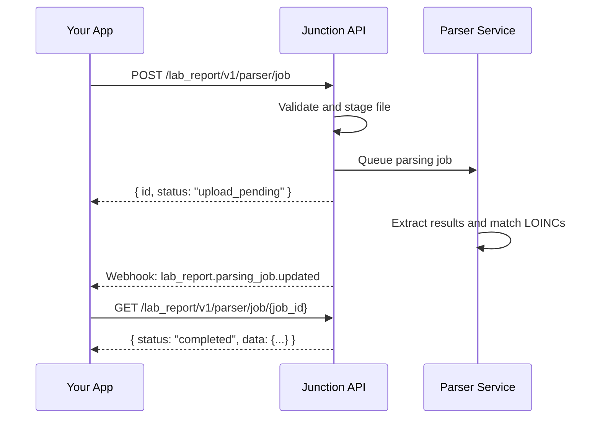

import FeatureBeta from '/snippets/feature-beta.mdx';

Junction's Lab Report Parsing API converts lab report files into structured JSON. You can upload PDF, JPEG, and PNG reports from external laboratories, patient-uploaded records, or historical chart archives, then retrieve extracted metadata, results, reference ranges, interpretations, and LOINC matches.

Lab Report Parsing is separate from Junction's ordered lab test workflow. It does not place an order, collect a sample, or request a result from a lab. It reads an existing report document and returns the data Junction can extract from that document.

<FeatureBeta />

## When to Use It

Use Lab Report Parsing when you already have a completed lab report file and need to make it usable in your application.

Common use cases include:

- Patient uploads of lab reports from outside providers
- Historical data imports from PDFs or scanned records
- Multi-lab result aggregation using LOINC as a normalization layer
- Backfilling structured results before a user starts ordering through Junction

If the result came from a Junction lab order, use the order [result format documentation](/lab/results/result-formats) and [results endpoints](/api-reference/lab-testing/results/get-results) instead.

## Workflow

The parsing workflow is asynchronous:

1. Upload one or more report files to create a parsing job.
2. Junction validates and stages the uploaded file, then queues the parsing job.
3. Junction extracts report metadata and lab results, then attempts to match extracted results to LOINC codes.
4. Your application receives a webhook or polls the job endpoint.
5. When the job is `completed`, the `data` object contains parsed metadata and results.



## Uploading Reports

Create a parsing job with the [Create Lab Report Parser Job](/api-reference/lab-testing/lab-report-parsing/post-lab-report-parser-job) endpoint. The request is `multipart/form-data` and requires:

| Field | Required | Description |
| --- | --- | --- |
| `file` | Yes | One lab report file, or multiple image files for one report. |
| `user_id` | Yes | Junction user ID to associate with the parsed report. |
| `needs_human_review` | No | Set to `true` to request manual review where enabled for your team. Defaults to `false`. |

Supported file formats and upload limits:

| Upload | Supported formats | Limit |
| --- | --- | --- |
| Single file | PDF, JPEG, or PNG | 10 MB |
| Multiple files | JPEG and PNG only | Up to 8 files, 10 MB per file, 20 MiB combined |
| PDF pages | PDF upload | Up to 20 pages |

When you upload multiple image files, Junction merges them into a single PDF before sending the report to the parser. Multi-file uploads cannot include PDFs. Junction validates both the declared `Content-Type` and the file's magic bytes, so spoofed or corrupted files are rejected before parsing starts.

```bash cURL
curl --request POST \
     --url {{BASE_URL}}/lab_report/v1/parser/job \
     --header 'accept: application/json' \
     --header 'x-vital-api-key: <YOUR_API_KEY>' \
     --header 'Content-Type: multipart/form-data' \
     --form 'file=@/path/to/lab_report.pdf' \
     --form 'user_id=<USER_ID>' \
     --form 'needs_human_review=false'
```

The create response returns the job immediately. At this point, `data` is `null` because parsing has not completed.

```json Response
{
  "id": "8eb0217f-4683-4a3c-adca-faf95ac65739",
  "status": "upload_pending",
  "failure_reason": null,
  "data": null,
  "needs_human_review": false,
  "is_reviewed": false
}
```

## Job Statuses

The `status` field describes the state of the parsing job.

| Status | Description |
| --- | --- |
| `upload_pending` | Job was created and the file upload is being finalized. This is the status returned by the create endpoint. |
| `started` | The file was uploaded and parsing is in progress. |
| `completed` | Parsing completed and results are available in `data`. |
| `failed` | Parsing failed. Check `failure_reason` for more information. |

For parser jobs, `failure_reason` commonly includes:

| Failure reason | Meaning |
| --- | --- |
| `invalid_input` | The parser determined that the document is not a lab report containing medical test results. |
| `not_english` | The report language is not supported. |
| `processing_error` | Junction could not process the report because of an internal parser or provider failure. |

<Note>
  Parser status and failure reason enums are non-exhaustive. Store unknown values safely and avoid hard-failing if Junction adds a new value or returns `failure_reason: null`.
</Note>

### Upload Validation Errors

Some invalid uploads are rejected synchronously by the create endpoint instead of becoming failed parser jobs. These errors return an HTTP error response and do not produce a completed async parsing result.

| Upload issue | Response behavior |
| --- | --- |
| Unsupported file type | `400` error before parsing starts. |
| Empty file | `400` error before parsing starts. |
| Declared `Content-Type` does not match file bytes | `400` error before parsing starts. |
| File is larger than the upload limit | `413` error before parsing starts. |
| PDF is corrupted, truncated, or unreadable | `400` error before parsing starts. |
| PDF exceeds the page limit | `400` error before parsing starts. |

## Human Review

Set `needs_human_review` to `true` to mark the job as requiring manual review where enabled for your team. Human review is useful for high-impact workflows, low-quality scans, complex multi-page reports, or reports where your application needs a higher-confidence extraction path.

Human review is not enabled for every team by default. Contact your account manager before depending on it in production.

If your team is not enabled for human review, creating a job with `needs_human_review=true` returns a `400` response:

```json Error
{
  "detail": "Human review is not supported yet for your team please contact support"
}
```

The response includes two review fields:

| Field | Meaning |
| --- | --- |
| `needs_human_review` | Whether the job was submitted with a manual-review request. |
| `is_reviewed` | Whether manual review has been completed, where a manual-review workflow is enabled. |

## Parsed Output

When `status` is `completed`, `data` contains:

| Field | Description |
| --- | --- |
| `metadata` | Patient and report-level metadata extracted from the document. |
| `results` | Array of extracted lab results. Each item represents one reported marker or observation. |

Example completed response:

```json Response
{
  "id": "8eb0217f-4683-4a3c-adca-faf95ac65739",
  "status": "completed",
  "failure_reason": null,
  "data": {
    "metadata": {
      "patient_first_name": "Jane",
      "patient_last_name": "Doe",
      "dob": "1990-01-01",
      "gender": "female",
      "lab_name": "Acme Labs",
      "date_reported": "2025-01-01",
      "date_collected": "2024-12-30",
      "specimen_number": "ABC123"
    },
    "results": [
      {
        "test_name": "Glucose",
        "value": "90",
        "type": "numeric",
        "units": "mg/dL",
        "min_reference_range": 70,
        "max_reference_range": 99,
        "source_panel_name": "CMP",
        "sample_type": "serum_plasma_blood",
        "measurement_kind": "direct",
        "sensitivity": "unknown",
        "loinc_match_status": "auto_match",
        "loinc_matches": [
          {
            "loinc_code": "2345-7",
            "loinc_name": "Glucose [Mass/volume] in Serum or Plasma",
            "display_name": "Glucose",
            "aliases": [],
            "confidence_score": 0.99
          }
        ],
        "interpretation": "normal",
        "is_above_max_range": false,
        "is_below_min_range": false
      }
    ]
  },
  "needs_human_review": false,
  "is_reviewed": false
}
```

### Metadata

`metadata` is extracted from the document header and surrounding report content when present.

| Field | Description |
| --- | --- |
| `patient_first_name` | Patient first name from the report. |
| `patient_last_name` | Patient last name from the report. |
| `dob` | Patient date of birth as printed or normalized from the report. |
| `gender` | Extracted patient gender normalized to `male`, `female`, or `other`. |
| `lab_name` | Name of the lab or reporting organization. |
| `date_reported` | Date the report was issued. |
| `date_collected` | Date the specimen was collected. |
| `specimen_number` | Lab specimen, accession, or sample identifier. |

Not every report contains every metadata field. Treat patient names, date of birth, lab name, report dates, and specimen number as nullable. Treat unknown or unsupported gender values as `other`.

### Result Fields

Each `data.results[]` item contains the extracted value and associated context.

| Field | Description |
| --- | --- |
| `test_name` | Normalized marker or observation name derived from the report. |
| `value` | Result value as a string. See [Value and Type](#value-and-type). |
| `type` | Result shape, such as `numeric`, `range`, or `comment`. |
| `units` | Units extracted from the report, when available. |
| `min_reference_range` | Numeric lower bound extracted from the reference range, when available. |
| `max_reference_range` | Numeric upper bound extracted from the reference range, when available. |
| `source_panel_name` | Panel name associated with the result, when available. |
| `sample_type` | Specimen type, such as `serum_plasma_blood`, `urine`, `saliva`, `stool`, `capillary_blood`, `other`, or `unknown`. |
| `measurement_kind` | Whether the result appears to be `direct`, `calculated`, `ratio`, or `unknown`. |
| `sensitivity` | Sensitivity classification when the report indicates it. |
| `interpretation` | Parsed or inferred interpretation. Possible values are `normal`, `abnormal`, `critical`, or `unknown`. |
| `is_above_max_range` | Whether the result is above `max_reference_range`, when this can be determined. |
| `is_below_min_range` | Whether the result is below `min_reference_range`, when this can be determined. |
| `loinc_match_status` | LOINC matching state: `auto_match`, `needs_review`, or `no_match`. |
| `loinc_matches` | Candidate LOINC matches with confidence scores. |

## Value and Type

`data.results[].value` is always returned as a string. Do not assume it can always be parsed as a number.

For `type: "numeric"`, `value` should be a number encoded as a string, such as `"5"` or `"5.0"`. For other result types, `value` can contain comparators, text, boolean-like values, durations, percentages, or ratios. Use `type` before deciding how to parse or display the value.

| Type | Example `value` | Notes |
| --- | --- | --- |
| `numeric` | `"90"`, `"1e-3"` | Numeric result encoded as a string. Use `units` for measurement units. |
| `range` | `"<5"`, `">=10"`, `"≤1e-3"`, `"3-7"` | May include comparators, approximate values, scientific notation, or lower-to-upper range notation. Do not parse as a plain float. |
| `comment` | `"Positive"`, `"See note"` | Textual result or observation. |
| `boolean` | `"true"`, `"false"`, `"yes"`, `"no"`, `"positive"`, `"negative"` | Boolean or presence-style findings can vary by report wording. |
| `duration` | `"3h"`, `"12 min"`, `"10:00"` | Duration-like values are preserved as strings because reports can use different formats. |
| `percentage` | `"5.4%"` | Inferred when the value includes `%`. If the value is `"5.4"` and `units` is `%`, the result may be returned as `numeric`; read `value`, `type`, and `units` together. |
| `ratio` | `"97/100"` | Slash-form ratios are inferred when `type` is not already supplied. Other ratio-like formats, such as colon-form titers, may be returned as `comment`. |

<Warning>
  The parser output is optimized to preserve what was reported. Store the raw `value` string and derive typed values in your application only after checking `type`, `units`, and reference range fields.
</Warning>

The parser-specific `type` values are related to, but not identical to, the order result `ResultType` values documented in [Result Formats](/lab/results/result-formats#resulttype). Parser results currently include `numeric`, `range`, `comment`, `boolean`, `duration`, `percentage`, and `ratio`.

When `type` is not supplied by extraction, Junction infers it from `value`. For example, `"<50"`, `"≥2000"`, and `"10-20"` are inferred as `range`; `"20%"` is inferred as `percentage`; `"97/100"` is inferred as `ratio`; and unrecognized text is inferred as `comment`.

## Reference Ranges and Interpretation

The parser may extract `min_reference_range` and `max_reference_range` as numeric bounds when the report includes a parseable reference range. It may also return:

- `interpretation`: possible values are `normal`, `abnormal`, `critical`, or `unknown`.
- `is_above_max_range`: whether the result is above the extracted maximum
- `is_below_min_range`: whether the result is below the extracted minimum

These fields depend on the quality and structure of the source report. Some reports include clear numeric bounds; others include textual ranges, age-specific ranges, sex-specific ranges, comments, or formatting that cannot be normalized into numeric bounds.

For numeric values, Junction can infer whether the result is above or below the extracted numeric reference bounds. For comparator range values, Junction only sets range flags when the comparator is conclusive. For example, `">2000"` with a max reference range of `1100` is above range, but `">500"` with the same max is inconclusive.

If a value is conclusively outside the extracted bounds, `interpretation` is `abnormal`. Numeric values without an out-of-range flag are interpreted as `normal`. Non-numeric and inconclusive range values are interpreted as `unknown` unless the parser extracted a more specific interpretation.

If you need custom boundary logic, read the result `value`, `type`, `units`, and reference range fields together. For general order-result reference range guidance, see [Reference Range](/lab/results/reference-range-parsing).

## LOINC Matching

Junction attempts to match extracted results to LOINC codes so you can compare markers across different labs and report formats.

Each `loinc_matches[]` item includes:

| Field | Description |
| --- | --- |
| `loinc_code` | LOINC code, such as `2345-7`. |
| `loinc_name` | Official or normalized LOINC name. |
| `display_name` | Display label for the match. |
| `aliases` | Alternate names associated with the match. |
| `confidence_score` | Relative score for this LOINC candidate. |

`confidence_score` is a matching score for the candidate LOINC code. It is not an accuracy score for the extracted lab result, patient metadata, units, reference ranges, or interpretation. A high score means Junction's LOINC matcher found a stronger candidate for that result row than lower-scored candidates; it does not prove that the source document was parsed correctly.

In most integrations, use `loinc_match_status` for workflow decisions instead of building your own thresholds on `confidence_score`. Store the score for debugging, audit, or support workflows, but avoid using it as a clinical-confidence or result-accuracy signal.

Use `loinc_match_status` to decide how much review your workflow needs:

| Status | Meaning |
| --- | --- |
| `auto_match` | Junction found a likely LOINC match. |
| `needs_review` | Junction found possible matches, but review is recommended. |
| `no_match` | Junction could not identify a match. |

<Warning>
  LOINC matches are not guaranteed for every extracted result. Your integration should handle `loinc_matches: null`, an empty match list, low confidence scores, `needs_review`, `no_match`, and future match statuses.
</Warning>

## Webhooks

Subscribe to parser events to avoid polling.

| Event | Trigger |
| --- | --- |
| `lab_report.parsing_job.created` | A new parsing job was created. |
| `lab_report.parsing_job.updated` | A parsing job changed status, including completion or failure. |

Webhook payloads include the user, team, and parsing job:

```json Webhook payload
{
  "event_type": "lab_report.parsing_job.updated",
  "user_id": "3fa85f64-5717-4562-b3fc-2c963f66afa6",
  "client_user_id": "7cbd6f62-0d22-4e5f-b7fd-bc4ee5c3fd8d",
  "team_id": "6353bcab-3526-4838-8c92-063fa760fb6b",
  "data": {
    "id": "8eb0217f-4683-4a3c-adca-faf95ac65739",
    "status": "completed",
    "failure_reason": null,
    "data": {
      "metadata": {
        "patient_first_name": "Jane",
        "patient_last_name": "Doe",
        "dob": "1990-01-01",
        "gender": "female",
        "lab_name": "Acme Labs",
        "date_reported": "2025-01-01",
        "date_collected": "2024-12-30",
        "specimen_number": "ABC123"
      },
      "results": [
        {
          "test_name": "Glucose",
          "value": "90",
          "type": "numeric",
          "units": "mg/dL",
          "min_reference_range": 70,
          "max_reference_range": 99,
          "loinc_match_status": "auto_match",
          "loinc_matches": [
            {
              "loinc_code": "2345-7",
              "loinc_name": "Glucose [Mass/volume] in Serum or Plasma",
              "display_name": "Glucose",
              "aliases": [],
              "confidence_score": 0.99
            }
          ],
          "interpretation": "normal",
          "is_above_max_range": false,
          "is_below_min_range": false
        }
      ]
    },
    "needs_human_review": false,
    "is_reviewed": false
  }
}
```

For webhook delivery behavior, retries, and event structure, see [Webhooks](/webhooks/introduction).

## Sandbox Limits

Sandbox lab report parsing has a team-level report limit. The error response includes the configured limit for your team. For example, a team limited to 150 reports receives:

```json Error
{
  "detail": "Sandbox lab report parsing is limited to 150 reports. Please upgrade your contract to continue."
}
```

This is a sandbox usage limit, not a file-level validation error. Retrying the same request, creating more users, or changing the report file does not reset the limit. Contact your account manager or [support@junction.com](mailto:support@junction.com) if you need the limit increased for higher-volume testing or production access.

## Integration Guidance

Build your parser integration defensively:

- Keep the original report file or a pointer to it in your system for audit and reprocessing workflows.
- Store `data.results[].value` as a string, even when `type` is `numeric`.
- Treat parser enums as non-exhaustive and log unknown `status`, `type`, `failure_reason`, `sample_type`, `measurement_kind`, and `loinc_match_status` values.
- Do not require LOINC matches to be present before displaying the extracted result to users.
- Review low-confidence or `needs_review` LOINC matches before using them for clinical decisioning, cohort logic, or automated recommendations.
- Expect null metadata and null reference range fields when the source report does not include parseable values.
- Use webhooks for normal processing and keep polling as a fallback for missed events or manual support flows.

## API Reference

- [Create Lab Report Parser Job](/api-reference/lab-testing/lab-report-parsing/post-lab-report-parser-job)
- [Get Lab Report Parser Job](/api-reference/lab-testing/lab-report-parsing/get-lab-report-parser-job)
- [Lab Report Parsing Job Created](/event-catalog/lab_report.parsing_job.created)
- [Lab Report Parsing Job Updated](/event-catalog/lab_report.parsing_job.updated)
