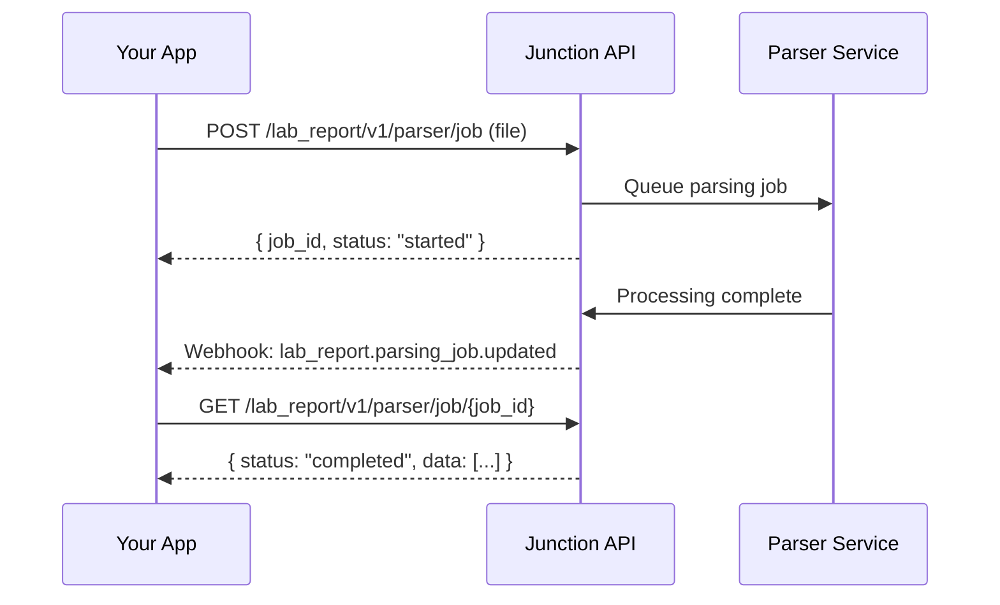

Junction's Lab Report Parsing API extracts structured data from lab report files (PDF, JPEG, or PNG) and matches biomarkers to standardized LOINC codes. This enables you to digitize and integrate lab results from any source into your application.

## How It Works

The parsing workflow consists of three steps:

1. **Upload** – Submit a lab report file to create a parsing job
2. **Process** – Junction extracts biomarker data and matches to LOINC codes
3. **Retrieve** – Get structured results with standardized identifiers



## Creating a Parsing Job

Upload a lab report file to create a parsing job:

```python Python
from vital.client import Vital
from vital.environment import VitalEnvironment

client = Vital(
  api_key="YOUR_API_KEY",
  environment=VitalEnvironment.SANDBOX
)

with open("lab_report.pdf", "rb") as f:
    job = client.lab_report.parser_create_job(
        file=f,
        needs_human_review=False
    )

print(f"Job ID: {job.id}")
print(f"Status: {job.status}")
```

### Supported File Formats

| Format | Extension       | Max Size |
| ------ | --------------- | -------- |
| PDF    | `.pdf`          | 10 MB    |
| JPEG   | `.jpg`, `.jpeg` | 10 MB    |
| PNG    | `.png`          | 10 MB    |

### Human Review

Set `needs_human_review=True` if you want Junction to manually verify extracted results before marking the job as complete. This is useful for:

- High-stakes clinical decisions
- Complex multi-page reports
- Reports with handwritten annotations

This is not enabled by default, and you need to contact support to enable it.

## Job Statuses

| Status           | Description                           |
| ---------------- | ------------------------------------- |
| `started`        | Job created and queued for processing |
| `processing`     | Extraction in progress                |
| `pending_review` | Awaiting human review (if requested)  |
| `completed`      | Results ready                         |
| `failed`         | Processing failed                     |

## Retrieving Results

Once a job completes, retrieve the extracted data:

```python Python
job = client.lab_report.parser_get_job(job_id="<job_id>")

if job.status == "completed":
    for result in job.data.results:
        print(f"{result.name}: {result.result} {result.unit}")
        print(f"  LOINC: {result.loinc} ({result.loinc_slug})")
```

### Result Structure

Each extracted biomarker includes:

- **name** – Biomarker name as it appears on the report
- **result** – The value (numeric or text)
- **unit** – Unit of measurement
- **loinc** – LOINC code for standardization
- **loinc_slug** – Human-readable LOINC identifier
- **reference_range** – Normal range from the report
- **interpretation** – `normal`, `abnormal`, or `critical`

<Info>
  LOINC matching enables you to compare results across different labs and
  integrate with other health systems using standardized identifiers.
</Info>

## Webhooks

Subscribe to parsing job events to avoid polling:

| Event                            | Trigger                                      |
| -------------------------------- | -------------------------------------------- |
| `lab_report.parsing_job.created` | New parsing job submitted                    |
| `lab_report.parsing_job.updated` | Job status changed (completed, failed, etc.) |

Example webhook payload:

```json
{
  "event_type": "lab_report.parsing_job.updated",
  "data": {
    "id": "8eb0217f-4683-4a3c-adca-faf95ac65739",
    "status": "completed",
    "failure_reason": None,
    "data": {
        "metadata": {
            "patient_first_name": "Jane",
            "patient_last_name": "Doe",
            "dob": "1990-01-01",
            "lab_name": "Acme Labs",
            "date_reported": "2025-01-01",
            "date_collected": "2024-12-30",
            "specimen_number": "ABC123",
        },
        "results": [
            {
                "test_name": "Glucose",
                "value": "90",
                "type": "numeric",
                "units": "mg/dL",
                "max_reference_range": 99,
                "min_reference_range": 70,
                "source_panel_name": "CMP",
                "loinc_matches": [
                    {
                        "loinc_code": "2345-7",
                        "loinc_name": "Glucose [Mass/volume] in Serum or Plasma",
                        "display_name": "Glucose",
                        "aliases": [],
                        "confidence_score": 0.99,
                    }
                ],
                "interpretation": "normal",
                "is_above_max_range": False,
                "is_below_min_range": False,
            }
        ],
    },
    "needs_human_review": False,
    "is_reviewed": False
  }
}
```

## Use Cases

### Patient-Uploaded Lab Results

Allow patients to upload lab reports from other providers:

```python
def handle_patient_upload(file, patient_id):
    job = client.lab_report.parser_create_job(file=file)

    # Store job_id linked to patient for later retrieval
    store_pending_job(patient_id, job.id)

    return {"message": "Processing your lab report..."}
```

### Historical Data Import

Digitize paper records or legacy PDFs:

```python
import os

for filename in os.listdir("historical_reports/"):
    with open(f"historical_reports/{filename}", "rb") as f:
        job = client.lab_report.parser_create_job(
            file=f,
            needs_human_review=True  # Verify historical data
        )
        print(f"Created job {job.id} for {filename}")
```

## API Reference

- [Create Lab Report Parser Job](/api-reference/lab-testing/lab-report-parsing/post-lab-report-parser-job)
- [Get Lab Report Parser Job](/api-reference/lab-testing/lab-report-parsing/get-lab-report-parser-job)
