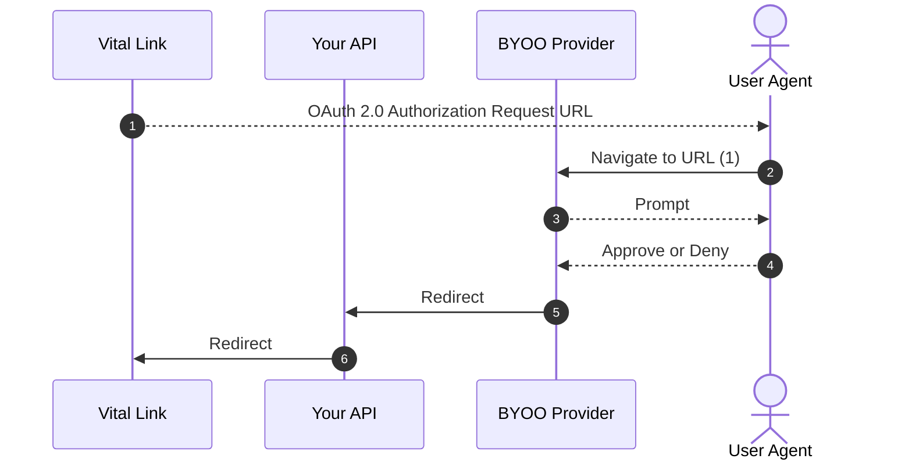

## Audience

This guide is dedicated to Vital customers looking to share the usage of their OAuth Client Credentials
between Vital [Bring Your Own OAuth](/wearables/connecting-providers/bring-your-own-oauth/overview) and their
existing production systems.

This guide is not applicable if you:

* do not have existing OAuth Client Credentials; or
* can configure your OAuth Client Credentials to point exclusively at Vital.


## Background

Many providers use OAuth 2.0, in which each partner entity is registered as a confidential application.
Each application is issued one set of OAuth client credentials (client ID + secret).

As a Cross-Site Request Forgery (CSRF) mitigation, they also typically require every application to pre-register
a Redirect URI. The `/authorize` flow would then validate inbound requests against the Redirect URI on record.

## Challenge

Most providers allow **only one** Redirect URI registration per OAuth application.

This means your OAuth application cannot simutaneously support both your own existing OAuth callback endpoint, as well as
[Vital Link](/wearables/connecting-providers/introduction) OAuth callback endpoint.


## Recommended Apporach

To support this credential sharing use case, Vital recommends you to:

1. Continue to point your OAuth application at your existing OAuth callback endpoint;

2. Extend your endpoint to [detect and redirect](#details) callbacks from Vital Link originiated OAuth requests to the
   [Vital Link OAuth callback endpoint](#vital-oauth-callback-endpoint-url).




### Details

<Steps>

<Step title="Keep your current OAuth application settings">

The Redirect URI in your OAuth application settings should continue to point at your
existing OAuth callback endpoint.

</Step>

<Step title="Extend your existing OAuth callback endpoint with Vital Link awareness">

Your OAuth callback endpoints can rely on the `state` query parameter to differentiate the request
origin, i.e., whether it is from Vital or from your own production systems.

OAuth requests originated from Vital would have the **Vital Link Token** as the `state` query parameter.
Vital Link Token is a JSON Web Token (JWT), so you can use the _unverified claims_ of the JWT as a discriminator.

When you detect a valid Vital Link Token, perform a `307 Temporary Redirect`
to the [Vital OAuth callback endpoint](#vital-oauth-callback-endpoint-url) and passing on _all_ the URL query parameters.

The exact JWT structure of the Vital Link Token is as follows:


<AccordionGroup>
<Accordion title="Encoding" defaultOpen>
A JSON Web Token (JWT).

<Warning>
You need not verify the signature of this JWT.

To prevent Cross-Site Request Forgery attacks, you must still check that the `aud` claim matches the
expected [Vital Link API Base URL](#vital-link-api-base-url).
</Warning>

</Accordion>
<Accordion title="Claim payload schema" defaultOpen>
| Key                     | Value                                           |
| ----------------------- | ----------------------------------------------- |
| `aud`                   | Vital Link API Base URL                         |
| `sub`                   | Vital Link Session ID                           |
| `team_id`               | Vital Team ID                                   |
| `user_id`               | Vital User ID                                   |
</Accordion>
<Accordion title="Vital Link API Base URL" defaultOpen>
| Environment             | Base URL |
| ----------------------- | -------- |
| Production US           | `https://api.tryvital.io/v2/link` 
| Production EU           | `https://api.eu.tryvital.io/v2/link` 
| Sandbox US              | `https://api.sandbox.tryvital.io/v2/link` 
| Sandbox EU              | `https://api.sandbox.eu.tryvital.io/v2/link` 
</Accordion>
<Accordion title="Vital OAuth callback endpoint URL" defaultOpen>
| Environment             | Base URL |
| ----------------------- | -------- |
| Production US           | `https://api.tryvital.io/v2/link/connect/{PROVIDER}` 
| Production EU           | `https://api.eu.tryvital.io/v2/link/connect/{PROVIDER}` 
| Sandbox US              | `https://api.sandbox.tryvital.io/v2/link/connect/{PROVIDER}` 
| Sandbox EU              | `https://api.sandbox.eu.tryvital.io/v2/link/connect/{PROVIDER}` 
</Accordion>
<Accordion title="Example" defaultOpen>
```python Python (FastAPI)
import fastapi
from urllib.parse import urlencode

VITAL_LINK_BASE_URL = "https://api.tryvital.io/v2/link"

@router.get("/oauth_callback/fitbit")
def handle_oauth_callback(
    request: fastapi.Request,
    state: Annotated[str, fastapi.Query()],
    ...,
) -> fastapi.Response:
    state_string = base64.b64decode(state)

    # Test if this is a JWT.
    # If so, try to extract the unverified claim payload, and see if this is
    # a Vital Link JWT.
    if (
        state_string.startswith('{"')
        and (state_parts := state_string.split(".", maxsplit=3))
        and len(state_parts) == 3
        and (unverified_claims := json.loads(state_parts[1]))
        and unverified_claims.get("aud") == VITAL_LINK_BASE_URL
    ):
        query = urlencode(request.query_params)

        return fastapi.RedirectResponse(f"{VITAL_LINK_BASE_URL}/connect/fitbit?{query}")


    # Not a Vital Link JWT. Fallback to existing logic
    return process_oauth_callback(...)

```
</Accordion>
</AccordionGroup>

</Step>

<Step title="Register your OAuth callback endpoint with Vital">

When you set your OAuth Client Credential through the [Set Team Custom Credentials](api-reference/org-management/team-custom-credentials/upsert-team-custom-credentials)
endpoint, you must specify a Redirect URI override that points at your your OAuth callback endpoint.

When a Redirect URI override is present, Vital uses the override value you provided to initiate the OAuth authorization flow.

</Step>

</Steps>
